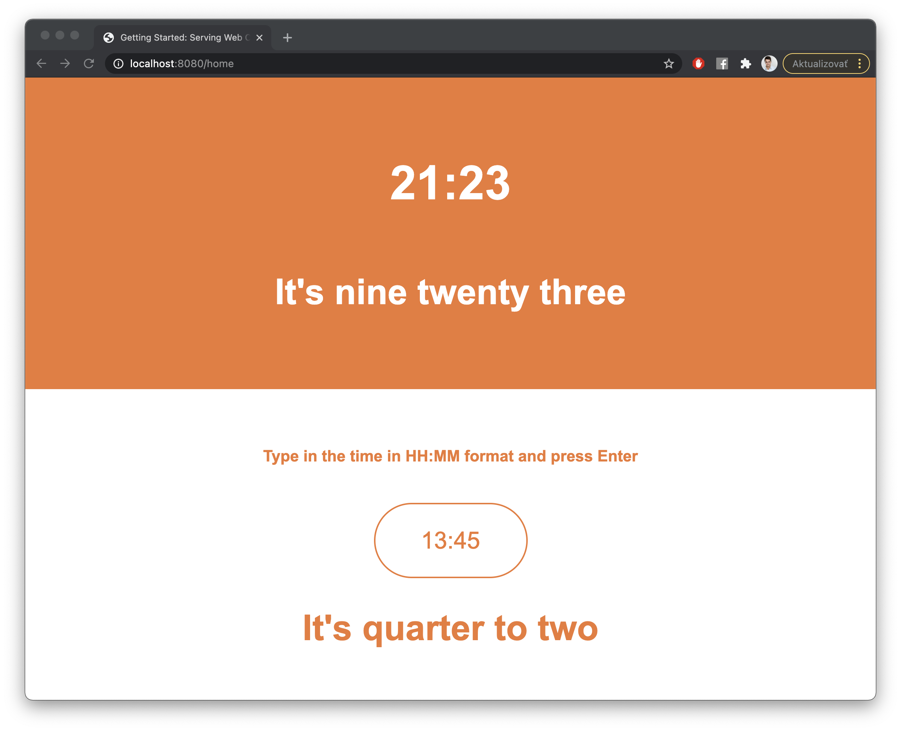

# SpokenTime webapp
This is a tiny webapp built on SpringBoot and javascript, that visualizes the works of SpokenTime library

## Usage
This is a SpringBoot app built with Maven. To run it correctly, you should have the SpokenTime library deployed in your local maven repository, see:

After that you can just run it using the **run** goal of spring-boot-maven-plugin
```
mvn spring-boot:run
```

Access the web app on localhost:8080/home and you should see something like this:


